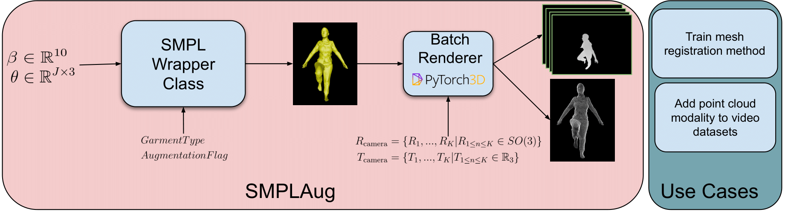

# SMPL AUGMENTATION LIBRARY 
<div style="text-align:center"></div>

**SMPLAug** is a data augmentation library specifically designed for the widely-used SMPL human body model. Our approach enables users to generate SMPL body models with added Kinect noise, clothing, and symmetric poses, helping to expand the quantity and quality of data for real-world applications.

We provide a framework for batch depth rendering and data augmentation of the SMPL body model. We aim to show the effectiveness of our framework in some plausible use cases:

    1) Data augmentation tool for 3D human-related tasks (e.g. 3D human registration and segmentation).
    2) Additional point cloud modality to RGB video with humans using an off-the-shelf body pose & shape estimation method.

We also release our code for training and evaluation at this [link](https://github.com/enesduran/smpl_net)

Huge shoutout to [SMPLX](https://github.com/vchoutas/smplx), [SCULPT](https://github.com/soubhiksanyal/SCULPT_release), [SimKinect](https://github.com/ankurhanda/simkinect) implementations. 

Contributors: Enes Duran, Mattia Masiero, Yunhan Wang

### Creating Environment 

Create environment by running:

```
conda env create -f env.yml
```

### Setup 

Here are the instructions for setting SCULPT and SMPL models.  

#### Body Models 

Our framework is compatible with [SMPL](https://smpl.is.tue.mpg.de/), [SMPLH](https://mano.is.tue.mpg.de) or [SMPLX](https://smpl-x.is.tue.mpg.de/) explicit body models. and register. Download version **1.1.0** and put them under `body_models` folder. If you have an existing body models folder, please set the path at `model_folder` in `configs/config.yaml`.

```
./body_models
    ├── smpl
    |   ├── SMPL_FEMALE.pkl
    |   ├── SMPL_MALE.pkl
    |   └── SMPL_NEUTRAL.pkl   
    ├── smplh(*) 
    |   ├── SMPLH_FEMALE.npz
    |   ├── SMPLH_MALE.npz
    |   └── SMPLH_NEUTRAL.npz
    └── smplx(*) 
        ├── SMPLX_FEMALE.npz
        ├── SMPLX_MALE.npz
        └── SMPLX_NEUTRAL.npz   
(*) optional
```

#### SCULPT (Optional)

Our framework uses SCULPT as a garment generation model. If you want to use this optional feature go to [SCULPT webpage](https://sculpt.is.tue.mpg.de/) and register. Download Pre-trained weights for the Geometry Network  and place them under `smplx/sculpt/data`. 

If you plan to use SCUPT to dress the SMPL body, please set the flag `--clothing-option clothed`.

#### Config file

You can set the body model path, motion npz file path, and camera config path in `configs/config.yaml`.

### Run Demo 

After setting the environment up, downloading models, and placing them under the corresponding paths, you are good to go! To run the augmentation:

To forward SMPL and get the corresponding Kinect depth and point cloud **with** cloth:

```
bash scripts/create_smpl_garment.sh
```

To forward SMPL and get the corresponding Kinect depth and point cloud **without** cloth:
```
bash scripts/create_smpl_minimal.sh
```

If you would like to use SMPL-X or SMPL-H for the forward pass, please change --body-model-type to smplx or smplh respectively.

When running demo.py, an SMPL wrapper class is first created with the provided SMPL model. Then, it loads the provided motions and synthesizes the corresponding augmented human point cloud. The results will be stored in `outdir`.
